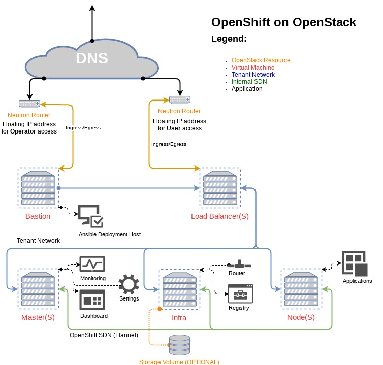

# OpenShift in an OpenStack using Ansible.

This repository will deploy several VMs in an OpenStack cloud assign a floating
IP address to a bastion host, run some basic commands across the cluster to
ensure a successful deployment, and then leverage
[OpenShift-Ansible](https://github.com/openshift/openshift-ansible) to deploy
OpenShift. The deployment on the bastion host will be conducted from a tmux
shell named `build-openshift` on the bastion host.

#### Assumptions

  * Ansible 2.2 is required
  * the python library "shade" is required to provision the virtual machines.
  * The host which you run the playbooks needs access to both the OpenStack API
    and the deployed VMs.
  * We're using OpenStack as an IaaS solution and provisioning VMs but we are
    not using additional "as a service" offerings; everything is contained
    within nova.
  * DNS services are external to the cluster.
  * Access to the Load balancer is ONLY accessible via a floating IP address.

#### Overview

This deployment setup will create all resources within openstack.



* DNS is assumed to be managed outside of the OpenShift Cluster
* Servers are used for all aspects of this deployment
* Tenant networks are used to connect all servers
* A floating IP address is assigned to the bastion server
* Load balancers, Masters, and Nodes can all have multiple servers
* The infra node is a single server
* The Bastion host is an Ansible deployment host for the entire OpenShift cluster
* Internal cluster connectivity is handled by flannel

#### Deployment from local host

Once the VMs are online and the hosts have been bootstrapped these playbooks
will create a tmux session named `build-openshift` and will run the *byo*
configuration playbook.

###### Running Ansible from a venv

If you run ansible from a venv you will need to set the python path within the
inventory for the **localhost** inventory entry.

###### OpenStack Credentials

Within the credentials file add the OpenStack credential information

###### OpenStack Inventory options

* os_net_name - name of the network used for intra cluster connectivity
* os_vip_pool_name - name of the network used for floating IP addresses
* os_flavor_name - name of the flavor for a given VM
* os_auth - hash containing the credentials to log into OpenStack, See the
  `creds.yml` file.

##### OpenStack Components required

Neutron needs to have the DNS plugin enabled for OpenShift to work properly.
is enabled by adding `dns` to the **extension_drivers** within the
`ml2_conf.ini` file.  The `dns_domain` option, set within the `neutron.conf`
file will also need to be set to an FQDN. If you've deployed the cloud with
OpenStack-Ansible add the following item to your `user_variables.yml`.

``` yaml
neutron_plugin_base:
  - router
  - metering
  - neutron_lbaas.services.loadbalancer.plugin.LoadBalancei
  - dns

neutron_dns_domain: "openstacklocal."
```

###### Deeper OpenStack integration

Within the included inventory file example OpenShift OpenStack options have been
included. In order for these options to work the deployed instances will need to
have access to the control plane on a public network. If your deployment of
OpenStack is using SSL the certificate MUST be a signed certificate and part of
the instances certificate chain.

Deploying within OpenStack gives OpenShift the ability to connect to persistent
storage using **cinder** and access to **Load Balancer as a Service** as well as
the ability to connect OpenShift to **Keystone** for authentication. If these
options are used **CARE** should be taken as this could open the Infrastructure
as a Service platform up to significant risk.

##### Run the deployment

With ansible and shade installed locally, run the playbooks sourcing the
credentials file.

``` bash
ansible-playbook -i inventory site.yml -e @creds.yml
```

###### Access to the control panel

Access to the control panel is gated by security groups and access to the
floating IP. DNS names are assumed to be setup for the floating cluster. The
inventory default within these playbooks sets the cluster public DNS name name
to **loadbalancer-1**. In production this should be changed to something more
suitable for the use. If remote DNS is not available simply add an entry into
the host file for the load balancer and the floating IP address.

###### Scaling the environment

Adding more nodes to the deployment is as simple as adding the needed entries
into inventory and then rerunning these playbooks. Note not all node types can
scale horizontally, see the architecture diagram for more details.
